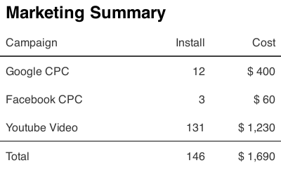
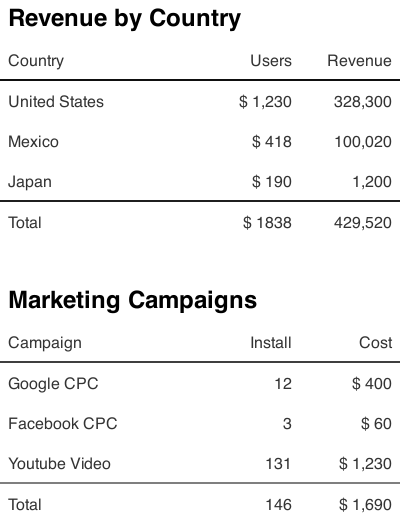

# table-renderer

> convert table or spreadsheet data into an image

## Background

One day, I had to build a slack slash command which reports marketing reports to our company slack channel. I wanted to format the command results look like table, but I could not find a simple way to do that. I decided to build a table-like view using markdown text, and struggled to do that. However, the layout was broken with small windows or with CJK charaters. So I decided to build the report as an image.



I hope this module will help someone who wants to convert a simple spreadsheet data into an image,

## Install

```bash
npm install table-renderer canvas
```

[node-canvas](https://github.com/Automattic/node-canvas) module is peer-dependency. You have to install it, too.

## Usage

### Single Table

```javascript
import path from 'path';
import TableRenderer, { saveImage } from 'table-renderer';

const renderTable = TableRenderer().render;

const canvas = renderTable({
	title: 'Marketing Summary',
	columns: [
		{ width: 200, title: 'Campaign', dataIndex: 'campaign' },
		{ width: 100, title: 'Install', dataIndex: 'install', align: 'right' },
		{ width: 100, title: 'Cost', dataIndex: 'cost', align: 'right' },
	],
	dataSource: [
		'-',
		{ campaign: 'Google CPC', install: '12', cost: '$ 400' },
		{ campaign: 'Facebook CPC', install: '3', cost: '$ 60' },
		{ campaign: 'Youtube Video', install: '131', cost: '$ 1,230' },
		'-',
		{ campaign: 'Total', install: '146', cost: '$ 1,690' },
	],
});

saveImage(canvas, path.join(__dirname, 'example.png'));
```


### Multiple Tables

You can pass multiple table data as Array.

```javascript
import path from 'path';
import TableRenderer, { saveImage } from 'table-renderer';

const renderTable = TableRenderer().render;

const canvas = renderTable([
	{
		title: 'Revenue by Country',
		columns: [
			{ width: 200, title: 'Country', dataIndex: 'country' },
			{ width: 100, title: 'Users', dataIndex: 'users', align: 'right', prefix: '$ ' },
			{ width: 100, title: 'Revenue', dataIndex: 'revenue', align: 'right' },
		],
		dataSource: [
			'-',
			{ country: 'United States', users: '1,230', revenue: '328,300' },
			{ country: 'Mexico', users: '418', revenue: '100,020' },
			{ country: 'Japan', users: '190', revenue: '1,200' },
			'-',
			{ country: 'Total', users: '1,838', revenue: '429,520' },
		],
	},
	{
		title: 'Marketing Campaigns',
		columns: [
			{ width: 200, title: 'Campaign', dataIndex: 'campaign' },
			{ width: 100, title: 'Install', dataIndex: 'install', align: 'right' },
			{ width: 100, title: 'Cost', dataIndex: 'cost', align: 'right' },
		],
		dataSource: [
			'-',
			{ campaign: 'Google CPC', install: '12', cost: '$ 400' },
			{ campaign: 'Facebook CPC', install: '3', cost: '$ 60' },
			{ campaign: 'Youtube Video', install: '131', cost: '$ 1,230' },
			'-',
			{ campaign: 'Total', install: '146', cost: '$ 1,690' },
		],
	},
]);

saveImage(canvas, path.join(__dirname, 'example.png'));
```

### Custom Fonts

```javascript
import path from 'path';
import { registerFont } from 'canvas';

registerFont(path.join(__dirname, 'fonts/lato-regular.ttf'), { family: 'lato', weight: 'normal' });

const renderTable = TableRenderer({ fontFamily: 'lato' }).render;

const canvas = renderTable([
	{
		title: 'Table with Custom Font',
        titleStyle: { font: 'normal 24px roboto' },
        columns: [...],
        dataSource: [...]
	},
]);
```



## API

-   [TableRenderer()](#tablerenderer)
-   [TableRenderer#render()](#tablerendererrender)
-   [saveImage()](#saveimage)

### TableRenderer

```javascript
TableRenderer({ cellWidth: number, cellHeight: number, offsetLeft: number, offsetTop: number, spacing: number }) => { render: function };
```

### TableRenderer#render

```javascript
render((tables: Object | Array)) => Canvas;
```

tables parameter is either Object or Array. Single table is comprised of title, columns, and dataSource, where title is optional. Parameters of render function resembles ant-design Table paramters.

The function returns Canvas object, which is an instance of [node-canvas](https://github.com/Automattic/node-canvas). So, you can add canvas operations to it.

```javascript
render({
    title: 'Marketing Summary',
    columns: [...],
    dataSource: [...]
});
```

### saveImage

```javascript
saveImage((canvas: Canvas), (filepath: String)) => Promise;
```
