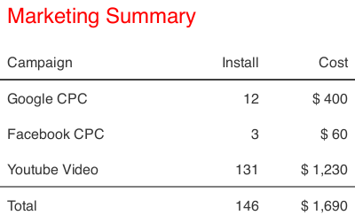

# Styling Title

You can customize title using titleStyle object.



```javascript
import path from 'path';
import TableRenderer, { saveImage } from '../../src';

const renderTable = TableRenderer({ titleSpacing: 10 }).render;

const canvas = renderTable({
	title: 'Marketing Summary',
	titleStyle: {
		font: 'normal 24px sans-serif',
		fillStyle: '#ff0000',
	},
	columns: [
		{ width: 200, title: 'Campaign', dataIndex: 'campaign' },
		{ width: 100, title: 'Install', dataIndex: 'install', align: 'right' },
		{ width: 100, title: 'Cost', dataIndex: 'cost', align: 'right' },
	],
	dataSource: [
		'-',
		{ campaign: 'Google CPC', install: '12', cost: '$ 400' },
		{ campaign: 'Facebook CPC', install: '3', cost: '$ 60' },
		{ campaign: 'Youtube Video', install: '131', cost: '$ 1,230' },
		'-',
		{ campaign: 'Total', install: '146', cost: '$ 1,690' },
	],
});

saveImage(canvas, path.join(__dirname, 'styling-title.png'));
```
